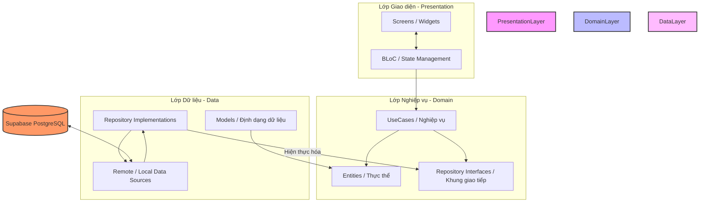
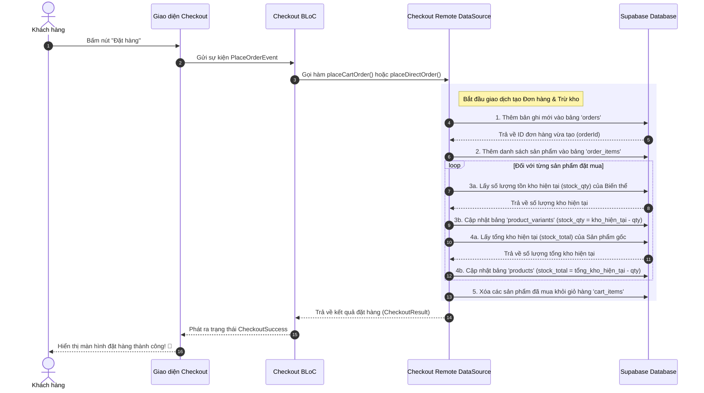

# 📑 BÁO CÁO TOÀN DIỆN: KIẾN TRÚC & CHỨC NĂNG HỆ THỐNG E-COMMERCE & ADMIN PORTAL (SHARECO)

Tài liệu này được biên soạn chi tiết nhằm giúp bạn nắm vững cấu trúc thư mục, kiến trúc phần mềm, luồng xử lý dữ liệu và cách tương tác với cơ sở dữ liệu **Supabase** của hệ thống E-Commerce và Admin Portal thuộc dự án **Shareco**. Bạn có thể dùng tài liệu này làm cẩm nang ôn tập để tự tin thuyết trình và trả lời xuất sắc mọi câu hỏi từ Giáo viên hướng dẫn/Hội đồng chấm thi.

---

## 🗺️ PHẦN 1: TỔNG QUAN KIẾN TRÚC SẠCH (CLEAN ARCHITECTURE)

Hệ thống được phát triển tuân thủ nghiêm ngặt mô hình **Clean Architecture** (Kiến trúc sạch). Mô hình này chia mã nguồn thành **3 lớp tách biệt hoàn toàn**: **Data (Dữ liệu)**, **Domain (Nghiệp vụ cốt lõi)**, và **Presentation (Giao diện hiển thị)**.

### 🌟 Tại sao phải dùng Clean Architecture?
1. **Dễ bảo trì và mở rộng (Maintainability & Scalability):** Khi bạn muốn đổi cơ sở dữ liệu (ví dụ từ Supabase sang Firebase) hoặc thay đổi thư viện UI, bạn chỉ cần sửa đổi lớp *Data* hoặc *Presentation*, còn lớp *Domain* (chứa logic nghiệp vụ cốt lõi) hoàn toàn được giữ nguyên.
2. **Dễ viết kiểm thử (Testability):** Bạn có thể viết Unit Test cho lớp *Domain* độc lập mà không cần khởi chạy ứng dụng hay kết nối mạng thực tế bằng cách sử dụng các đối tượng giả lập (Mock Repositories).
3. **Tính độc lập cao (Decoupling):** Giao diện UI không được phép biết cách kết nối trực tiếp đến database, nó chỉ biết gọi các hành động (UseCases). Cơ sở dữ liệu cũng không được phép áp đặt cấu trúc dữ liệu lên giao diện hiển thị.



---

## 📂 PHẦN 2: LÝ DO MỖI THƯ MỤC CHỨC NĂNG CÓ CẤU TRÚC "DATA - DOMAIN - PRESENTATION"

Trong các dự án Flutter chuyên nghiệp quy mô lớn, người ta thường áp dụng mô hình kết hợp **Feature-First (Theo Tính năng)** và **Layered Architecture (Kiến trúc phân lớp)**. 

Thay vì gom tất cả các file Data của cả ứng dụng vào một chỗ, gom tất cả UI vào một chỗ khác, chúng ta chia ứng dụng thành các tính năng độc lập (như `shop`, `cart`, `checkout`...). Bên trong **mỗi tính năng đó** lại được chia thành 3 lớp riêng biệt: **Data**, **Domain** và **Presentation**.

### 🌟 Ý nghĩa thiết kế này mang lại:
1. **Tính đóng gói tối đa (High Encapsulation):** Mỗi thư mục tính năng là một "tiểu ứng dụng" tự vận hành. Nó tự quản lý từ giao diện, nghiệp vụ cho đến cách lấy dữ liệu từ database. Nếu bạn muốn xóa bỏ tính năng `review`, bạn chỉ cần xóa thư mục `review` mà không sợ làm hỏng các tính năng khác.
2. **Dễ phân chia công việc:** Lập trình viên A có thể phát triển toàn bộ luồng của tính năng `cart` (từ thiết kế UI, viết BLoC đến viết hàm gọi Supabase) trong thư mục `cart` mà không đụng chạm đến file của lập trình viên B đang phát triển tính năng `shop`.

---

### 🔍 Giải thích chi tiết vai trò của từng Thư mục con bên trong mỗi Tính năng:

Để dễ hình dung, chúng ta lấy thư mục **`shop`** làm ví dụ điển hình cho cấu trúc phân lớp này:

```
lib/features/ecommerce/shop/
├── data/                    <-- Lớp Dữ liệu (Hiện thực kết nối dữ liệu)
│   ├── datasources/         <-- Nơi gọi trực tiếp database Supabase
│   ├── models/              <-- Định dạng dữ liệu thô nhận về (Map/JSON)
│   └── repositories/        <-- Nhận data thô, biến đổi thành thực thể sạch
├── domain/                  <-- Lớp Nghiệp vụ (Thiết kế hệ thống cốt lõi)
│   ├── entities/            <-- Cấu trúc dữ liệu thuần dùng cho UI hiển thị
│   ├── repositories/        <-- Bản thiết kế trừu tượng (Interface) các hàm
│   └── usecases/            <-- Từng kịch bản/hành động nghiệp vụ chi tiết
└── presentation/            <-- Lớp Giao diện (Hiển thị & Xử lý tương tác)
    ├── bloc/                <-- Quản lý luồng trạng thái của giao diện
    └── screen/              <-- File giao diện Flutter vẽ màn hình người dùng
```

#### 1. Thư mục `domain/` (Nghiệp vụ - Trái tim của tính năng)
Lớp này lưu trữ logic nghiệp vụ cốt lõi và các thực thể dữ liệu "sạch" nhất, không liên quan đến cơ sở dữ liệu.
* **`entities/` (Ví dụ: `shop.dart`):** Định nghĩa cấu trúc dữ liệu của một Cửa hàng/Thương hiệu mà giao diện sẽ hiển thị (như Tên, Logo, Đánh giá trung bình...). File này chỉ chứa thuộc tính và hàm khởi tạo, hoàn toàn **không chứa mã chuyển đổi dữ liệu từ API (`fromJson`/`toJson`)**.
* **`repositories/` (Ví dụ: `shop_repository.dart`):** Định nghĩa một class trừu tượng (`abstract class`). Nó hoạt động như một **bản hợp đồng** quy định những hành động mà tính năng này có thể làm (ví dụ: *Tôi cần một hàm để lấy chi tiết gian hàng*). Nó không lập trình chi tiết hàm đó chạy thế nào, mà để lớp *Data* hiện thực hóa sau.
* **`usecases/` (Ví dụ: `get_shop_details.dart`):** Chứa các lớp thực hiện **một hành động duy nhất** của người dùng. Ví dụ, use case `GetShopDetails` chỉ làm đúng một việc: gọi hàm từ repository để lấy thông tin shop và trả về cho BLoC.

#### 2. Thư mục `data/` (Dữ liệu - Kết nối cơ sở dữ liệu bên ngoài)
Lớp này chịu trách nhiệm trực tiếp trong việc kết nối mạng, đọc/ghi dữ liệu và chuyển đổi dữ liệu thô từ cơ sở dữ liệu thành thực thể có nghĩa.
* **`datasources/` (Ví dụ: `shop_remote_datasource.dart`):** Đây là nơi **gọi trực tiếp Supabase Client** để thực thi các câu lệnh truy vấn SQL. Nó lấy về các dữ liệu dạng bản đồ khóa - giá trị (`Map<String, dynamic>` hoặc `JSON`).
* **`models/` (Ví dụ: `shop_model.dart`):** Kế thừa (`extends`) từ Entity ở lớp Domain. Class này bổ sung thêm các hàm **`fromJson()`** (để chuyển dữ liệu JSON từ Supabase thành đối tượng Dart) và **`toJson()`** (để chuyển đối tượng Dart thành JSON gửi lên Supabase).
* **`repositories/` (Ví dụ: `shop_repository_impl.dart`):** Kế thừa và hiện thực hóa bản hợp đồng từ `domain/repositories/shop_repository.dart`. Nó sẽ gọi hàm của `RemoteDataSource` để lấy về đối tượng `ShopModel`, sau đó chuyển đổi (`cast`) đối tượng này thành thực thể `Shop` thuần túy và trả ngược lại cho lớp Domain.

#### 3. Thư mục `presentation/` (Giao diện - Tương tác trực quan với người dùng)
Lớp này xử lý việc hiển thị giao diện người dùng và phản hồi lại các thao tác nhấn nút, nhập liệu của họ.
* **`bloc/` (Ví dụ: `shop_bloc.dart`, `shop_event.dart`, `shop_state.dart`):** Quản lý trạng thái giao diện bằng thư viện Flutter BLoC.
  * **`shop_event.dart`:** Khai báo các hành động của người dùng (Ví dụ: người dùng mở trang thương hiệu thì kích hoạt sự kiện `FetchShopDetailsEvent`).
  * **`shop_state.dart`:** Khai báo các trạng thái giao diện có thể xảy ra (Ví dụ: `ShopLoading` đang tải, `ShopLoaded` tải thành công kèm dữ liệu, `ShopError` lỗi tải).
  * **`shop_bloc.dart`:** Nhận sự kiện `Event`, gọi UseCase tương ứng từ lớp Domain, nhận về kết quả và phát ra trạng thái `State` phù hợp.
* **`screen/` (Ví dụ: `shop_detail_screen.dart`):** Đây là màn hình Flutter trực quan. Nó lắng nghe các trạng thái (`State`) từ BLoC phát ra: nếu là `ShopLoading` thì hiển thị vòng tròn xoay xoay, nếu là `ShopLoaded` thì vẽ lên các thông tin thương hiệu, hình ảnh logo cực kỳ đẹp mắt.

---

## 📑 PHẦN 3: PHÂN TÍCH CHI TIẾT TỪNG FILE TRONG 8 THƯ MỤC TÍNH NĂNG

Dưới đây là mô tả chi tiết, cụ thể hóa từng file Dart của từng thư mục tính năng trong hệ thống E-Commerce Shareco để bạn hiểu rõ luồng chạy thực tế:

---

### 1. 🏷️ Thư mục `shop` (Quản lý Gian hàng & Nhãn hiệu)
* **Mục đích:** Xử lý toàn bộ thông tin liên quan đến các đối tác thương hiệu trên sàn.

#### 📂 Các file bên trong lớp Data:
* **`shop_remote_datasource.dart`:**
  * *Chức năng:* Chứa hàm `fetchShopDetails(String shopId)`. Hàm này gọi `Supabase.instance.client.from('shops').select().eq('id', shopId).single()` để lấy dữ liệu thô của nhãn hàng từ database.
* **`shop_model.dart`:**
  * *Chức năng:* Định nghĩa lớp `ShopModel` kế thừa từ `Shop`. Chứa hàm `factory ShopModel.fromJson(Map<String, dynamic> json)` để ánh xạ các cột dữ liệu từ bảng `shops` (như `shop_name`, `logo_path`, `cover_path`, `rating_avg`) vào các thuộc tính của Dart.
* **`shop_repository_impl.dart`:**
  * *Chức năng:* Kế thừa `ShopRepository`. Triển khai hàm `getShopDetails(String shopId)`. Gọi hàm từ `RemoteDataSource`, nhận về `ShopModel`, trả về kiểu thực thể `Shop` thuần túy.

#### 📂 Các file bên trong lớp Domain:
* **`shop.dart` (Entity):**
  * *Chức năng:* Khai báo lớp `Shop` với các thuộc tính cần hiển thị trên giao diện: tên thương hiệu, mô tả, ảnh đại diện, ảnh bìa, xếp hạng sao, trạng thái hoạt động.
* **`shop_repository.dart` (Interface):**
  * *Chức năng:* Khai báo giao diện trừu tượng `abstract class ShopRepository` định nghĩa chữ ký hàm `Future<Shop> getShopDetails(String shopId);`.
* **`get_shop_details_usecase.dart`:**
  * *Chức năng:* Chứa lớp `GetShopDetails` có phương thức `call(String shopId)`. Nó nhận yêu cầu lấy thông tin và chuyển tiếp yêu cầu đó đến `ShopRepository`.

#### 📂 Các file bên trong lớp Presentation:
* **`shop_bloc.dart` / `shop_event.dart` / `shop_state.dart`:**
  * *Chức năng:* Nhận sự kiện yêu cầu nạp thông tin gian hàng (`FetchShopDetails`), kích hoạt UseCase lấy dữ liệu, phát ra trạng thái `ShopLoaded` chứa thực thể `Shop`.
* **`shop_detail_screen.dart`:**
  * *Chức năng:* Giao diện hiển thị trang cá nhân của nhãn hàng. Hiển thị ảnh bìa lớn, logo hình tròn bo góc, mô tả thương hiệu, điểm đánh giá trung bình cùng danh sách các sản phẩm thuộc thương hiệu đó.

---

### 📦 2. Thư mục `product` (Quản lý Sản phẩm & Biến thể)
* **Mục đích:** Tìm kiếm, lọc sản phẩm theo danh mục/thương hiệu và hiển thị chi tiết sản phẩm cùng các biến thể đi kèm.

#### 📂 Các file bên trong lớp Data:
* **`product_remote_datasource.dart`:**
  * *Chức năng:* Thực hiện các câu lệnh select nâng cao đến bảng `products` của Supabase. Hỗ trợ gom nhóm biến thể bằng cách join bảng: `.select('*, product_variants(*)')`.
* **`product_model.dart` & `product_variant_model.dart`:**
  * *Chức năng:* Phân tích cú pháp các cột dữ liệu thô từ bảng `products` và `product_variants` (như `price_min`, `compare_at_price`, `stock_qty`, `weight_grams`).
* **`product_repository_impl.dart`:**
  * *Chức năng:* Hiện thực hóa việc lấy sản phẩm từ dữ liệu mạng, lọc theo loại sản phẩm hoặc nhãn hàng rồi chuyển đổi thành danh sách thực thể `Product` trả về cho hệ thống.

#### 📂 Các file bên trong lớp Domain:
* **`product.dart` & `product_variant.dart` (Entities):**
  * *Chức năng:* Khai báo cấu trúc dữ liệu sạch của Sản phẩm và Biến thể của sản phẩm. Đặc biệt chứa thuộc tính động: `bool get isActive => status == 'active';` để xác định sản phẩm có đang được phép bán hay không.
* **`get_products_usecase.dart` & `get_product_detail_usecase.dart`:**
  * *Chức năng:* Các kịch bản nghiệp vụ lấy danh sách sản phẩm theo bộ lọc hoặc lấy chi tiết một sản phẩm cụ thể kèm theo toàn bộ biến thể của nó.

#### 📂 Các file bên trong lớp Presentation:
* **`product_list_screen.dart`:**
  * *Chức năng:* Hiển thị lưới sản phẩm thời trang, mỹ phẩm đẹp mắt. Tích hợp thanh tìm kiếm và bộ lọc nhanh theo thương hiệu.
* **`product_detail_screen.dart`:**
  * *Chức năng:* Màn hình chi tiết sản phẩm. Cho phép người dùng chọn phân loại biến thể (ví dụ: Dung tích `50ml` hoặc `100ml`), tự động thay đổi giá tiền và hiển thị cảnh báo hết hàng nếu số lượng tồn kho `stock_qty` của biến thể đó bằng `0`.

---

### 🛒 3. Thư mục `cart` (Quản lý Giỏ hàng)
* **Mục đích:** Lưu trữ, đồng bộ các mặt hàng mà người mua dự định đặt hàng lên Supabase.

#### 📂 Các file bên trong lớp Data:
* **`cart_remote_datasource.dart`:**
  * *Chức năng:* Thực thi các câu lệnh thêm, sửa số lượng, và xóa bản ghi trong bảng `cart_items` của Supabase. Khi thêm sản phẩm mới vào giỏ hàng, hàm này sẽ kiểm tra xem sản phẩm đó đã tồn tại trong giỏ chưa để tự động cộng dồn số lượng.
* **`cart_item_model.dart`:**
  * *Chức năng:* Ánh xạ dữ liệu giỏ hàng nhận về từ bảng `cart_items` kết hợp thông tin sản phẩm liên kết từ bảng `products`.

#### 📂 Các file bên trong lớp Presentation:
* **`cart_screen.dart`:**
  * *Chức năng:* Giao diện giỏ hàng của người dùng. Cho phép tăng/giảm số lượng bằng nút `+` / `-`, hiển thị giá tiền tạm tính, và gom nhóm các sản phẩm theo từng Nhãn hàng chủ quản để người dùng dễ dàng theo dõi phí giao hàng.

---

### 💳 4. Thư mục `checkout` (Quy trình Đặt hàng & Trừ kho)
* **Mục đích:** Thực hiện tính toán giảm giá của voucher khuyến mãi, thu thập thông tin người nhận, tạo đơn hàng và trừ tồn kho tự động.

#### 📂 Các file bên trong lớp Data:
* **`checkout_remote_datasource.dart`:**
  * *Chức năng:* Đây là **trọng tâm xử lý giao dịch** đặt hàng.
    * Hàm `placeCartOrder` thực hiện thêm đơn hàng mới vào bảng `orders`, thêm các dòng chi tiết vào bảng `order_items`, **sau đó thực hiện trừ kho tự động**: cập nhật giảm cột `stock_qty` của bảng `product_variants` và giảm cột `stock_total` của bảng `products` tương ứng với số lượng đã mua. Cuối cùng xóa sạch giỏ hàng.
    * Hàm `placeDirectOrder` xử lý tương tự dành riêng cho luồng khách hàng bấm nút "Mua ngay" trực tiếp tại trang chi tiết sản phẩm.

#### 📂 Các file bên trong lớp Presentation:
* **`checkout_screen.dart`:**
  * *Chức năng:* Màn hình thanh toán cực kỳ cao cấp. Cho phép chọn địa chỉ giao hàng mặc định, hiển thị danh sách sản phẩm đặt mua, nhập ghi chú đơn hàng, tích chọn Voucher ưu đãi từ nhãn hàng, tự động tính toán số tiền được giảm giá thời gian thực và hiển thị tổng tiền thanh toán cuối cùng.

---

### 📋 5. Thư mục `order` (Quản lý Đơn hàng của khách)
* **Mục đích:** Hiển thị lịch sử mua sắm của khách hàng và cho phép khách hàng hủy đơn hàng chờ xử lý.

#### 📂 Các tệp quan trọng:
* **`order_remote_datasource.dart`:** Truy vấn danh sách đơn hàng từ bảng `orders` của người dùng hiện tại, sắp xếp theo thời gian đặt hàng mới nhất. Cho phép khách hàng gửi lệnh update cột `status` thành `'cancelled'` để hủy đơn hàng.
* **`order_list_screen.dart`:** Giao diện Shopee-style hiển thị danh sách đơn hàng được phân loại thành các tab trạng thái: `Chờ xác nhận`, `Đã đóng gói`, `Đang giao`, `Đã hoàn thành`, `Đã hủy`.

---

### 📍 6. Thư mục `address` (Quản lý Địa chỉ nhận hàng)
* **Mục đích:** Cho phép khách hàng thiết lập danh sách địa chỉ nhận hàng cá nhân.

#### 📂 Các tệp quan trọng:
* **`address_remote_datasource.dart`:** Thực hiện thêm địa chỉ mới, cập nhật thông tin địa chỉ cũ, và đặt địa chỉ mặc định bằng cách cập nhật cột `is_default` trong bảng `user_addresses`.
* **`address_list_screen.dart` & `address_form_screen.dart`:** Giao diện hiển thị danh sách địa chỉ giao hàng và form điền thông tin người nhận chuyên nghiệp.

---

### 🌟 7. Thư mục `review` (Đánh giá sản phẩm)
* **Mục đích:** Thu thập phản hồi từ người dùng sau khi nhận hàng để cải thiện chất lượng sản phẩm.

#### 📂 Các tệp quan trọng:
* **`review_remote_datasource.dart`:** Chèn bản ghi đánh giá sao và mô tả nhận xét của người dùng vào bảng `product_reviews`.
* **`product_reviews_widget` (Hiển thị ở trang chi tiết sản phẩm):** Lấy danh sách các nhận xét của sản phẩm đó hiển thị ra giao diện giúp khách hàng mới tham khảo trước khi mua.

---

### 👑 8. Thư mục `admin` (Cổng Quản trị Tối cao & Nhãn Hàng)
* **Mục đích:** Portal quản lý toàn bộ hoạt động thương mại điện tử dành cho Super Admin (Quản trị sàn) và Brand Owner (Chủ nhãn hàng).

#### 📂 Các tệp quan trọng:
* **`admin_login_screen.dart`:** Màn hình đăng nhập cổng admin. Đã được lược bỏ hoàn toàn các trường điền sẵn tự động để nâng cao bảo mật. Hướng dẫn chi tiết tài khoản kiểm thử được mô tả rõ trong file `admin_accounts_info.md`.
* **`admin_shops_screen.dart`:** Trang quản lý thương hiệu dành riêng cho Super Admin. Chỉ hiển thị danh sách thương hiệu, số lượng người theo dõi, đánh giá trung bình. Có nút "Cấp tích xanh uy tín", nút "Khóa/Mở khóa hoạt động của nhãn hàng" và hộp thoại chỉnh sửa mô tả/ảnh logo/ảnh bìa nhãn hàng.
* **`admin_products_screen.dart`:** Kho quản lý sản phẩm. Hiển thị danh sách sản phẩm cùng giá bán và số lượng tồn kho. **Tích hợp tính năng đảo nhanh trạng thái trực tiếp (Đang bán <--> Ẩn/Ngừng)** bằng cách bấm trực tiếp lên nhãn trạng thái (Status Badge) vô cùng trực quan và mượt mà.
* **`admin_product_form_screen.dart`:** Form đăng bán sản phẩm mới/Cập nhật sản phẩm cũ đa năng. Tự động chuyển đổi file ảnh từ máy tính tải lên Supabase Storage lấy link liên kết trực tiếp, tự động tạo mã SKU tiêu chuẩn theo định dạng `SKU-<Tên_Nhãn_Hàng>-STANDARD` và điền sẵn giá vốn, cân nặng mặc định.
* **`admin_orders_screen.dart`:** Danh sách đơn hàng cần xử lý. Tích hợp kênh lắng nghe thời gian thực của Supabase để tự động tải lại danh sách khi có đơn mới phát sinh. Cung cấp nút "Xác nhận đóng gói" để chuyển trạng thái đơn hàng sang `'packed'` cực kỳ nhanh chóng.

---

## 🔄 PHẦN 4: LUỒNG HOẠT ĐỘNG TIÊU BIỂU TRONG HỆ THỐNG

Dưới đây là sơ đồ và giải thích chi tiết về luồng hoạt động cốt lõi của ứng dụng khi khách hàng đặt mua sản phẩm và cách hệ thống xử lý tồn kho:

### 🛒 Luồng Đặt hàng & Trừ kho tự động (Checkout & Stock Update Flow)



---

## ⚡ PHẦN 5: CÁCH GỌI VÀ TƯƠNG TÁC VỚI SUPABASE CHI TIẾT

Hệ thống giao tiếp với cơ sở dữ liệu Supabase (được xây dựng trên nền tảng PostgreSQL) thông qua gói thư viện chính thức `supabase_flutter`. Dưới đây là các kỹ thuật gọi truy vấn chi tiết được áp dụng trong dự án:

### 1. Hàm truy vấn dữ liệu thông thường (SELECT)
Chúng ta gọi dữ liệu bằng cách sử dụng các hàm lọc `.select()`, `.eq()`, `.order()` cực kỳ linh hoạt.
```dart
// Lấy danh sách sản phẩm theo từng Nhãn hàng (shopId) cụ thể
final response = await Supabase.instance.client
    .from('products')
    .select('*, product_variants(*)') // JOIN lấy kèm danh sách biến thể của sản phẩm đó
    .eq('shop_id', shopId)
    .order('created_at', ascending: false);
```

### 2. Hàm thêm mới dữ liệu (INSERT)
```dart
// Thêm một nhãn hàng đối tác mới
await Supabase.instance.client.from('shops').insert({
  'shop_name': name,
  'description': description,
  'shop_slug': slug,
  'logo_path': logoUrl,
  'cover_path': coverUrl,
  'status': 'active',
});
```

### 3. Hàm cập nhật dữ liệu trực tiếp (UPDATE)
Dùng để thay đổi thông tin hoặc đảo trạng thái hoạt động của sản phẩm ngay tại chỗ.
```dart
// Đảo trạng thái hoạt động của sản phẩm (Đang bán <--> Ẩn/Ngừng)
await Supabase.instance.client
    .from('products')
    .update({'status': 'inactive'}) // chuyển sang trạng thái ẩn ngừng
    .eq('id', productId);
```

### 4. Công nghệ Lắng nghe Sự kiện Thời gian thực (Supabase Realtime Channel)
Trong màn hình quản lý đơn hàng của Admin (`admin_orders_screen.dart`), để Admin không cần tải lại trang mỗi khi khách đặt đơn mới, ta thiết lập một kênh kết nối liên tục (Websocket) để lắng nghe sự thay đổi của bảng `orders`:
```dart
// 1. Tạo một kênh kết nối realtime
final _ordersChannel = Supabase.instance.client
    .channel('public:orders')
    // 2. Lắng nghe mọi sự kiện INSERT hoặc UPDATE trên bảng 'orders'
    .onPostgresChanges(
      event: PostgresChangeEvent.all,
      schema: 'public',
      table: 'orders',
      callback: (payload) {
        debugPrint('Có đơn hàng mới hoặc đơn hàng vừa được cập nhật!');
        // 3. Tự động kích hoạt gọi BLoC tải lại danh sách đơn hàng tức thì
        _adminBloc.add(AdminFetchOrders(shopId: _selectedShopId));
      },
    );

// 4. Kích hoạt kết nối lắng nghe
_ordersChannel.subscribe();
```

---

## 🎓 PHẦN 6: BỘ CÂU HỎI VÀ ĐÁP ÁN (Q&A CHEAT SHEET) THUYẾT TRÌNH TRƯỚC GIÁO VIÊN

Dưới đây là những câu hỏi cực kỳ hóc búa mà các giáo viên hướng dẫn thường hỏi để kiểm tra xem bạn có thực sự hiểu bài hay không, đi kèm là gợi ý trả lời thông minh giúp bạn đạt điểm tối đa:

#### 💬 Câu hỏi 1: Tại sao em lại phân tách thư mục của mình thành các phần "address", "cart", "checkout", "product", "shop" riêng biệt thay vì dồn chung vào một file?
* **💡 Trả lời:** Thưa thầy/cô, việc chia nhỏ cấu trúc thư mục theo mô hình **Feature-First (Theo tính năng)** giúp hệ thống đạt được tính đóng gói rất cao. Mỗi module như `cart` hay `checkout` sẽ tự quản lý toàn bộ các lớp giao diện, nghiệp vụ và dữ liệu của riêng nó. Thiết kế này giúp dự án cực kỳ dễ đọc, dễ bảo trì, và khi có nhiều lập trình viên cùng làm việc, chúng em có thể phát triển song song các tính năng khác nhau mà không lo bị xung đột mã nguồn (code conflict).

#### 💬 Câu hỏi 2: Sự khác nhau giữa lớp Entity (trong Domain) và lớp Model (trong Data) is gì? Tại sao không dùng chung một lớp cho đỡ tốn file?
* **💡 Trả lời:** Đây là nguyên tắc cốt lõi của Clean Architecture nhằm đảm bảo **tính độc lập của lớp nghiệp vụ**. 
  * **Entity** là đối tượng thuần túy đại diện cho nghiệp vụ của doanh nghiệp ở lớp Domain, hoàn toàn không biết gì về cơ sở dữ liệu hay mạng internet.
  * **Model** nằm ở lớp Data, kế thừa từ Entity nhưng được trang bị thêm các hàm phân tích cú pháp dữ liệu như `fromJson` và `toJson`.
  Nếu chúng em dồn chung làm một, lớp nghiệp vụ cốt lõi sẽ bị phụ thuộc chặt chẽ vào cấu trúc bảng của Supabase hay API bên ngoài. Khi database thay đổi tên cột hoặc cấu trúc JSON, chúng em sẽ buộc phải sửa đổi lại toàn bộ logic nghiệp vụ bên trong ứng dụng, điều này vi phạm nguyên tắc thiết kế phần mềm bền vững.

#### 💬 Câu hỏi 3: Hệ thống của em xử lý việc trừ tồn kho như thế nào khi khách đặt hàng thành công? Có đảm bảo không bị âm kho không?
* **💡 Trả lời:** Thưa thầy/cô, logic trừ kho của hệ thống được thực hiện khép kín và cực kỳ an toàn ngay trong lớp dữ liệu (`checkout_remote_datasource.dart`). Khi tạo đơn hàng thành công, hệ thống sẽ thực thi trừ số lượng mua trực tiếp vào cột `stock_qty` của bảng biến thể sản phẩm (`product_variants`) và cột `stock_total` của sản phẩm gốc (`products`). Để đảm bảo tính an toàn tối đa và tránh việc kho hàng bị ghi nhận số âm dưới các điều kiện đặc biệt, chúng em đã áp dụng hàm giới hạn biên dưới `.clamp(0, 999999)`.

#### 💬 Câu hỏi 4: Làm thế nào để cổng quản trị Admin phân biệt được người đăng nhập là Super Admin hệ thống hay là Đối tác nhãn hàng để phân quyền màn hình cho đúng?
* **💡 Trả lời:** Hệ thống sử dụng một lớp lưu trữ phiên làm việc toàn cục tên là `AdminSession`. Khi người dùng đăng nhập qua màn hình `AdminLoginScreen`:
  * Nếu Email chứa từ khóa `"admin"`, hệ thống ghi nhận vai trò `loggedInRole = 'admin'` (Super Admin) và chuyển hướng tới màn hình quản lý thương hiệu `shops`. Màn hình này cho phép quản lý tích xanh, chặn hoặc cấp phép hoạt động đối tác.
  * Nếu Email thuộc về đối tác (như `loreal@shareco.vn`), hệ thống ghi nhận vai trò `loggedInRole = 'shop'` kèm theo `loggedInShopId` tương ứng. Giao diện Sidebar (`admin_layout.dart`) sẽ tự động ẩn đi phần quản lý thương hiệu toàn sàn, chỉ hiển thị "Kho hàng của tôi" và "Đơn hàng của tôi" được lọc chính xác theo `shopId` của đối tác đó, đảm bảo tính bảo mật và độc lập tuyệt đối giữa các nhãn hàng.
